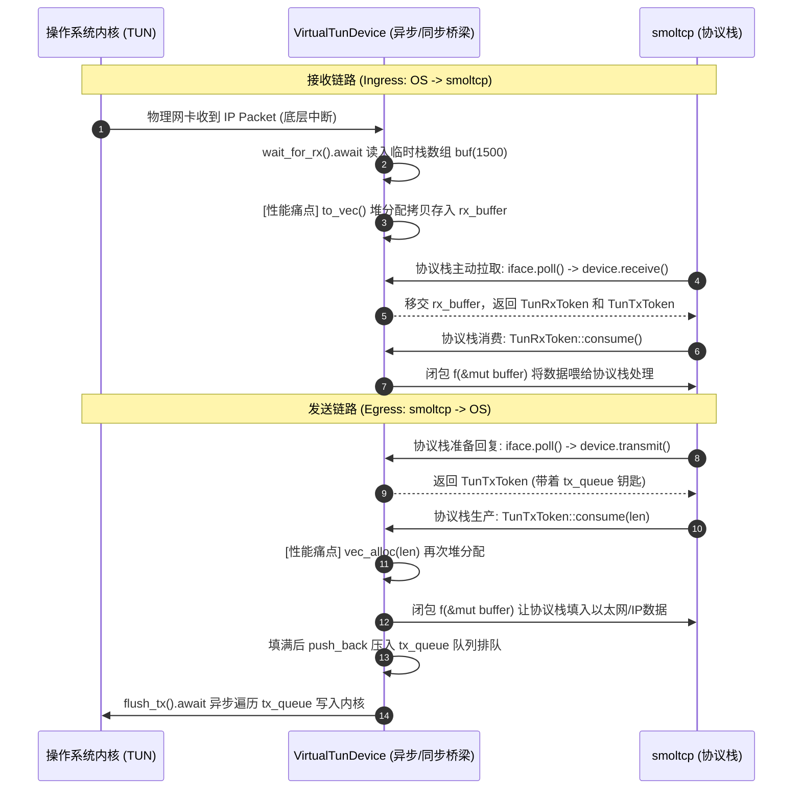

- 这是我输出的关键代码片段：

```rust
pub async fn start_tun_proxy() {
    let mut root_cert_store = RootCertStore::empty();
    let cert_file = &mut BufReader::new(File::open("cert.pem").unwrap());
    let certs = rustls_pemfile::certs(cert_file).unwrap();
    for cert in certs {
        root_cert_store.add(&Certificate(cert)).unwrap();
    }
    let config = ClientConfig::builder()
        .with_safe_defaults()
        .with_root_certificates(root_cert_store)
        .with_no_client_auth();
    let connector = TlsConnector::from(Arc::new(config));

    // 记录：房间号 -> 专属通道的发送端 (注意 Sender 需要指定发送的数据类型 Vec<u8>)
    let mut active_connections: HashMap<SocketHandle, mpsc::Sender<Vec<u8>>> = HashMap::new();
    // 全局回信通道：接收端 global_rx 留在主循环，发送端 global_tx 会被克隆给每个后台车厢
    let (global_tx, mut global_rx) = tokio::sync::mpsc::channel::<(SocketHandle, Vec<u8>)>(1024);
    // =========== 1. 初始化底层网卡和通道 ===========

    // 1. 初始化 TUN 设备(化底层网卡和通道) / 创建操作系统的原生异步虚拟网卡
    let raw_tun = create_tun_device().await;
    // 使用 raw_tun 实例化我们的包装器
    let mut device = VirtualTunDevice::new(raw_tun);

    // =========== 2. 初始化 smoltcp 酒店和路由器 ===========
    // 2. 初始化 smoltcp 的“酒店”
    let mut sockets = SocketSet::new(vec![]);

    let tcp_rx_buffer = TcpSocketBuffer::new(vec![0; 65535]);
    let tcp_tx_buffer = TcpSocketBuffer::new(vec![0; 65535]);
    let mut tcp_socket = TcpSocket::new(tcp_rx_buffer, tcp_tx_buffer);
    // 为了让它能接客（比如截获我们在终端里发起的 curl 请求），我们需要让它开始监听 (Listen) 特定的端口，比如 HTTP 常用的 80 端口。
    tcp_socket.listen(80).unwrap();
    // socket_handle：房间号/把手
    let socket_handle = sockets.add(tcp_socket);

    // 3. 初始化 smoltcp 的“虚拟路由器”
    let config = SmolConfig::new(smoltcp::wire::HardwareAddress::Ip);
    // 这里传入了包装好的 &mut device
    let mut iface = Interface::new(config, &mut device, smoltcp::time::Instant::now());

    // 给虚拟路由器配置 IP 地址 (10.0.0.1/24)
    iface.update_ip_addrs(|ip_addrs| {
        ip_addrs
            .push(IpCidr::new(IpAddress::v4(10, 0, 0, 2), 24))
            .unwrap();
    });

    // 3. 初始化定时器 (例如每 5 毫秒触发一次)
    let mut timer = tokio::time::interval(std::time::Duration::from_millis(5));
    println!("🚀 TUN 虚拟网卡主循环启动！试试 ping 10.0.0.2");

    let domain = match ServerName::try_from("localhost") {
        Ok(domain) => domain,
        Err(e) => {
            println!("解析 SNI 域名失败: {e:?}");
            return;
        }
    };

    let server_stream = TcpStream::connect("127.0.0.1:8081")
        .await
        .expect("TcpStream 连接错误");

     let tls_stream = match connector.clone().connect(domain, server_stream).await {
        Ok(s) => s,
        Err(e) => {
            println!("与代理服务端 TLS 握手失败: {:?}", e);
            return;
        }
    };
    println!("✅ 成功连接到洛杉矶代理服务器！");
    let mut yamux_conn =
        Connection::new(tls_stream.compat(), YamuxConfig::default(), Mode::Client);
    // 获取遥控器 ctr
    let ctr = yamux_conn.control();

    //使用 tokio::spawn 把 Yamux 引擎放到后台 poll 运行。🚂
    tokio::spawn(async move {
        while let Ok(Some(_)) = yamux_conn.next_stream().await {}
        println!("与服务端的 Yamux 长连接已断开，请重启 Client");
    });

    loop {
        //...
    }
}
```
----


- 执行：`curl 10.0.0.2:80` 有内容返回；
- 再次执行：`curl 10.0.0.2:80` 输出：`curl: (7) Failed to connect to 10.0.0.2 port 80 after 1 ms: Couldn't connect to server`

- Client输出：

```ini
与代理服务端 TLS 握手失败: Custom { kind: InvalidData, error: InvalidCertificate(Other(CaUsedAsEndEntity)) }
```

- Server输出：

```ini
TLS 握手失败: Custom { kind: InvalidData, error: AlertReceived(CertificateUnknown) }
```

```sh
openssl req -x509 -newkey rsa:2048 -keyout key.pem -out cert.pem -days 365 -nodes -subj "/CN=localhost"

# req -x509: 指定创建自签名证书。
# -newkey rsa:2048: 生成一个 2048 位的 RSA 私钥。
# -keyout key.pem: 指定输出的私钥文件名。
# -out cert.pem: 指定输出的证书文件名。
# -days 365: 证书有效期为 365 天。
# -nodes (No DES): 生成不加密的私钥（本地测试用），无需输入密码。
# -subj "/CN=localhost": 直接填写证书申请信息，跳过交互式问答。
```


## TUN

```
utun0: flags=8051<UP,POINTOPOINT,RUNNING,MULTICAST> mtu 1380
	inet6 fe80::4a93:8ff6:27a3:aee2%utun0 prefixlen 64 scopeid 0x11 
	nd6 options=201<PERFORMNUD,DAD>
```





## Todo

- 性能目标：当前是单机调试链路，建议先把目标定成 1k pps 以内 ICMP 不丢、 read -> iface.poll() 路径 P99 < 5ms 、空闲内存基线 < 1MB 、空闲 CPU < 5% 。
- 安全与合规：现阶段主要是本机 utun 调试，权限边界是 sudo cargo run ；后续若做产品化，建议切到 Network Extension 支持路径。
- 潜在瓶颈：当前热路径里有 read -> Vec::to_vec -> smoltcp -> Vec 的额外拷贝， read/write 是 syscall 热点；但你这次“完全收不到包”的主因不是性能，而是接入语义错了。
- 

```sh
# 这是客户端收到的包：
[0, 0, 2, 69, 0, 0, 64, 0, 0, 64, 0, 64, 6, 38, 182, 10, 0, 0, 1, 10, 0, 0, 2, 231, 18, 0, 80, 143, 245, 2, 232, 0, 0, 0, 0, 176, 194, 255, 255, 134, 216, 0, 0, 2, 4, 5, 180, 1, 3, 3, 6, 1, 1, 8, 10, 212, 185, 76, 103, 0, 0, 0, 0, 4, 2, 0, 0]
```


📄 src/main.rs: 指挥中心。只负责解析命令行参数，然后按需启动 Client 或 Server。
📄 src/server.rs: 服务端基站。封装 Server 模式下的监听、TLS 握手和 Yamux 逻辑。
📄 src/client.rs: 客户端引擎。封装 SOCKS5 解析、长连接维护和多路复用逻辑。

- 运行 `cargo run -- server`，启动服务端。
- 运行 `cargo run -- client`，启动客户端。
- 错误流程：`关闭服务端` -> `启动服务端`，客服端不会主动重连，这是什么原因？
